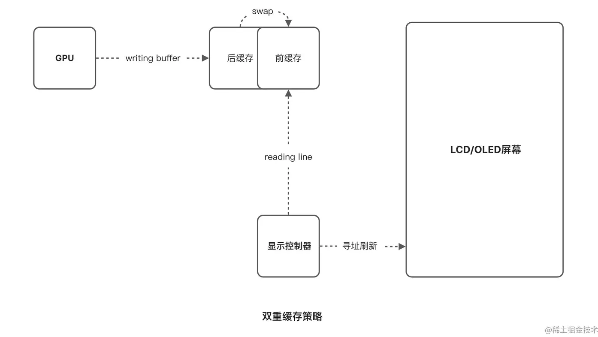
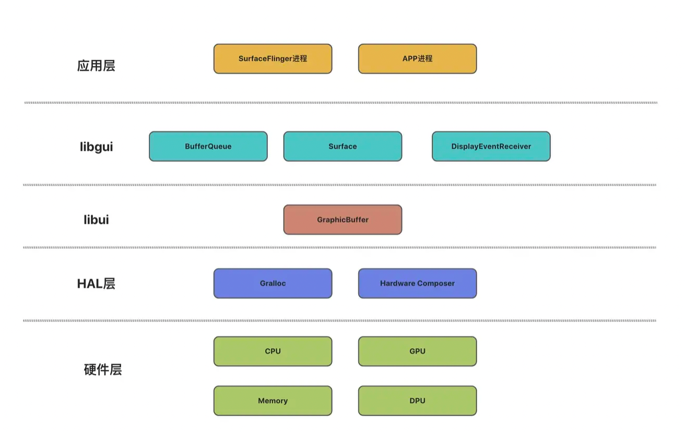
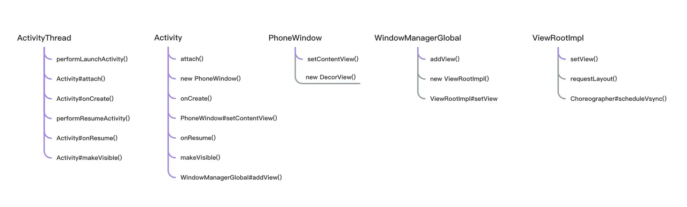

**图形系统之应用篇**

https://juejin.cn/post/6939540905581887502
一些测试：
https://juejin.cn/post/7140332948485570596

测量是为了计算每一个 View 需要的大小，View 和 ViewGroup 都需要重写 onMeasure() 方法来确定自己的尺寸
布局是为了计算每一个 View 的位置，通常只需要 ViewGroup 重写 onLayout() 方法，根据容器的属性合理的摆放子 View
绘制是最终绘图的阶段，所有的绘图操作都在 draw 阶段得到执行，通常需要 View 重写 onDraw() 方法


# 一 Measure

`MeasureSpec`int三十二位整数来表示，封装了View的size（后三十位）和mode属性，即为宽高属性，与使用相应测量模式作为依据，调整最终尺寸。

> *帮助子View确定大小*
* UNSPECIFIED ViewGroup对于View没有任何限制，View可以拿到任意想要的SIZE
* EXACTLY View本身设定了确切的大小
* AT_MOST size是View能够占据的最大空间，对于wrap_content,View可以在父容器可以容纳的范围内申请空间

`LayoutParams`封装了View的width和height属性，默认解析在布局文件中设置的layout_width,layout_height。也可以外部动态设置

> View的MeasureSpec由其父容器ViewGroup的MeasureSpec和View自身的LayoutParams共同决定
>   * View能够占据的尺寸，肯定收到父容器ViewGroup的影响，一般不会超过ViewGroup容纳范围，除非viewGroup本身支持滑动（如ScrollView）

## MeasureSpec在可滑动view的特点
MeasureSpec 是由什么决定的？
大多数情况下，父视图通过调用 getChildMeasureSpec() 方法为子 View 生成测量结果，那么子 View 的MeasureSpec 是由父视图的 SpecMode 和 子 View 自身的 LayoutParams 共同决定的
当父视图是调用 makeMeasureSpec() 方法为子 View 指定测量结果时（比如示例中的 ScrollView），子 View 的MeasureSpec 是由父视图的业务属性决定的！


**DecorView** 是整个视图树的根布局，而 DecorView 是 FrameLayout 的子类，所以说平时我们在 Activity 中 setContentView 其实就是在向 DecorView 执行 addView 操作。很自然地，整个视图树的测量过程就是要从 DecorView 开始，从上到下从外到内进行，DecorView 的尺寸大小就是整个视图树所能占据的最大空间，而 DecorView 的宽高默认都是 match_parent，即占据整个屏幕空间
V

## ViewRootImpl && View
View绘制的整个流程的启动入口，从ViewRootImpl的performTraversals开始看
用于为DecorView生成MeasureSpec

**performTraversals**
* 获取Spec
  * 屏幕的宽高：mWidth,mHeight 
  * DecorView的宽高：lp.width,lp.height
* 测量整个视图树 
  * performMeasure，mView代表DecorView，启动测量流程，measure

**measure-final**
measure final方法，View子类和ViewGroup都无法重写，在其中完成一些通用都调用逻辑之后

=》
**onMeasure**

默认情况下，onMeasure方法会考虑View自身是否设置了minWidth和background,取两者最小作为View最终尺寸的参考依据
然后区分【UNSPECIFIED】和【EXACTLY或AT_MOST】两种情况
将结果，SetMeasuredDimension
> onMeasure方法是自定义View需要重写的方法
onMeasure方法中，自定义View完成自身尺寸的测量逻辑，如ViewGroup除了测量自身外，需要测量所有的childView
> 且在确定最终尺寸时，注意区分【UNSPECIFIED】和【EXACTLY】和【AT_MOST】三种情况

**setMeasuredDimension-final**
setMeasuredDimension也是final方法，不可被重写，把上一步测量获得的
measuredWidth与measuredHeight，进行传递。用于后续Layout阶段，确定最终View的宽高

## ViewGroup流程
不同ViewGroup有不同的布局效果，因此宽高属性的计算规则各有差异，
体现在**onMeasure**方法中
例如FrameLayout
* 考虑FrameLayout自身的padding，minimumSize等 
* 考虑各个childView的measureWidth和measureHeight（其中会考虑到childView的margin，然后考虑到父容器的MeasureSpec测量标准和自身childView的LayoutParams）
* 且FrameLayout需要考虑一种特殊情况：假设 FrameLayout 的 layout_width 设置为 wrap_content，而某个 childView 的 layout_width 设置为 match_parent。此时对于 FrameLayout 来说其宽度并没有确定值，需要依靠所有 childView 来决定。对于该 childView 来说，其希望的是宽度占满整个 FrameLayout。所以此时该 childView 的widthSpecSize就应该是 FrameLayout 当前的 widthMeasureSize，widthSpecMode 应该是 EXACTLY才对。而 FrameLayout 也只有在完成所有 childView 的 measure 操作后才能得到自己的widthMeasureSize，所以第二步逻辑就是来进行补救措施，判断是否需要让 childView 进行第二次 measure

对于 DecorView 来说，其 MeasureSpec 是通过测量屏幕宽高来生成的，这从 ViewRootImpl 的 performTraversals() 方法就可以体现出来
对于 View（包括ViewGroup）来说，其 MeasureSpec 是由其父容器 ViewGroup 的 MeasureSpec 和 View 自身的 LayoutParams 来共同决定的。

重复：父容器向子视图-下发测量要求-接受测量结果

### 如Android 为 ViewGroup 准备了几个测量子 View 的方法
```java
//frameworks/base/core/java/android/view/ViewGroup.java

/**
 * measureChild()：调用 getChildMeasureSpec() 方法生成子视图的 MeasureSpec ，成功后通知子视图执行 measure() 方法
 measureChildWithMargins() ：调用 getChildMeasureSpec() 方法生成子视图的 MeasureSpec ，成功后通知子视图执行 measure() 方法
 getChildMeasureSpec()：根据父视图的 MeasureSpec 和 子视图的 LayoutParams 属性来生成 子视图的 MeasureSpec
 */
class ViewGroup extends View {

  	//测量子视图
    void measureChild() {
        LayoutParams lp = child.getLayoutParams();
        int childWidthMeasureSpec = getChildMeasureSpec();
        int childHeightMeasureSpec = getChildMeasureSpec();
        child.measure(childWidthMeasureSpec, childHeightMeasureSpec);
    }

  	//测量子视图并计算其Margin
    void measureChildWithMargins() {
        MarginLayoutParams lp = (MarginLayoutParams) child.getLayoutParams();
        int childWidthMeasureSpec = getChildMeasureSpec();
        int childHeightMeasureSpec = getChildMeasureSpec();
        child.measure(childWidthMeasureSpec, childHeightMeasureSpec);
    }

  	//获取子View的MeasureSpec，对于ViewGroup来说，这是非常重要的一个方法！！！
    int getChildMeasureSpec(int spec, int padding, int childDimension) {
        ...
    }

}

```

# 二、Layout
Layout 代表的是确定位置的过程，在这个过程中 View 需要计算得出自己在父容器中的显示位置

**performLayout**
View 的 layout 起始点也是从 ViewRootImpl 开始的，ViewRootImpl 的 performLayout 方法会调用

**layout** 启动layout流程

对于`View`，传入的四个参数即我们熟知的 left、top、right、bottom，这四个值都是 View 相对父容器 ViewGroup 的坐标值

对于`DecorView`， 来说这四个值就分别是 0、0、screenWidth、screenHeight

**setFrame** 将四个值保存到View的相应全局变量，用于确定width,height。
回调onSizeChanged接受宽高的变化通知
> 自定义View通过layout？方法，得到View的准确宽高大小，并接受宽高大小的变化通知

**onLayout**
对于ViewGroup来说，
layout方法调用onLayout方法，onLayout方法在View类中是空实现，大部分情况下View无需重写。
ViewGroup中，是抽象方法，每个ViewGroup的子类， 需要实现onLayout来管理所有childView的摆放位置


# 三、Draw
绘制视图，View通过操作Canvas来实现自己的UI效果

**performDraw**
起始点从ViewRootImpl的performDraw方法开始,
用 drawSoftware 方法，再通过调用 DecorView 的 draw 方法来启动 draw 流程

**onDraw**
对于View来说，重写onDraw来绘制内容，实现自己的特定UI，无需关心dispatchDraw

**dispatchDraw**
对于viewGroup来说，除了需要绘制背景色，前景色，无需绘制自身，
所以ViewGroup无需重写onDraw，应使用dispatchDraw，向所有childView下发Draw请求

## DecorView 的 draw
draw() 方法中一共完成了4件事：
调用 drawBackground() 方法画 ViewGroup 的背景
调用自身的 onDraw() 方法执行 Canvas 绘图逻辑
调用 dispatchDraw() 通知子 View 执行 draw()
调用 onDrawForeground() 方法画视图的前景

## 启动硬件加速的流程
应用启用硬件加速以后，
onDraw() 方法中的指令将不再被执行，
而是被收集到 DisplayList 集合中，等到所有需要绘制的 View 的 draw() 方法执行结束后，这些指令将会被同步到 RenderThread 渲染线程执行真正的绘图工作


# 四、问题

## 1.ViewGroup 和 View 的绘制顺序
measure 阶段是先 View 后 ViewGroup
layout 阶段是先 ViewGroup 后 View
draw 阶段是先 ViewGroup 后 View

以 FrameLayout 为例，其 onMeasure 方法就需要先去完成所有 childView 的 measure 操作，得到 maxWidth 和 maxHeight 后才能确定自己的尺寸值

在 layout 阶段，FrameLayout 的 setFrame 方法已经将外部传入的 left、top、right、bottom 等四个值保存起来了，至此 ViewGroup 自身的位置信息就已经确定下来了，之后才会调用 layoutChildren 方法去执行 childView 的 layout 操作

在 draw 阶段，FrameLayout 也是先执行自己的 onDraw 方法后，再去执行 dispatchDraw 方法，这也说明 ViewGroup 是先完成自身的绘制需求后才去绘制 childView，毕竟 ViewGroup 的视图显示层次要比 View 低


## 2.View 多个回调函数的先后顺序
（常用的）
Activity 从开始展示到退出页面这个过程，View 的这五个方法的先后顺序是：

父容器的 onAttachedToWindow 和 onVisibilityChanged 会先后调用，之后才会调用 childView 的这两个方法
childView 的 onDetachedFromWindow 会先被调用，所有 childView 都调用后才会调用父容器的该方法
View 的绘制流程就按照 onMeasure、onLayout、onLayout 的顺序进行，onAttachedToWindow 和 onVisibilityChanged 都会早于这三个方法

## 3.getWidth 和 getMeasuredWidth 的区别
getMeasuredWidth() 和 getMeasuredHeight()返回的是 View 在 measure 阶段的测量结果，用于在 onMeasure 方法后调用。getWidth() 和 getHeight()返回的是 View 的实际宽高值，用于在 onLayout 方法后调用。这两者可以说是 View 在不同阶段下的一个尺寸值，大多数情况下这两个值都是相等的，但 measureWidth 只是相当于一个预估值，View 的最终宽度并不一定遵循该值，View 的实际宽高需要在 layout 阶段才能最终确定下来
例如，我们完全可以通过重写 layout 方法来使得 View 的位置发生偏移，这就可以使得 View 的 width 和 measureWidth 两者不相等
```java
@Override
public void layout(int l, int t, int r, int b) {
super.layout(l, t, r + 10, b + 10);
}
```


# 系列链接

## 图形系统之屏幕（LCD和OLED）
：7094171161570836517
市场屏幕类型基本可以分为两种：LCD屏和OLED屏
相较于LCD屏幕，OLED屏幕
1）支持更高的亮度、对比度以及更艳丽的色彩
2）更快的响应速度，高刷体验更好
3）不需要背光板，采用COP方案封装，理论上可以去掉宽下巴
OLED缺陷：烧屏，低频PWM调光（频率越低，人眼发觉频闪的机会就越小，越不伤眼）

LCD屏幕基板是无机玻璃材料，所以几乎不会发生老化，而OLED基板是有机塑料材料，就意味着它会渐渐老化。LCD要么全亮要么全灭，所以就算老化，也是全部老化，你也看不出来
OLED由于每个像素点是自发光，而不是LCD那样整块全部亮，这就会导致OLED每个像素点工作的时间不一样
OLED屏幕非常容易发生一个现象就是烧屏，**其本质就是屏幕老化不均匀导致的残留**


## 图形系统之驱动（垂直同步）
：https://juejin.cn/post/7109743178353213454
> 屏幕刷新率：
在一秒钟内电子束能够扫描出一幅完整画面的次数，被称为屏幕的刷新率，表示单位为HZ

> 帧率：
每秒钟记录（拍摄）或者输出（播放）画面的数量

当刷新率和帧率不匹配时，计算机是如何处理的呢？显卡和显示器是如何协同工作的呢？
操作系统启动后，开启出一块内存专门用于画面显示，这块共享内存是"帧缓冲区"，`frame buffer`，可以位于显存，也可以位于内存，由操作系统分配。
在不进行任何设置的前提下，操作系统通常使用的是双缓存策略：
显示控制器驱动正在读取的是一个帧缓存，我们称之为“前缓存”
显卡绘制后写入的另一个帧缓存，称之为“后缓存”，显卡绘制完一帧后通知CPU交换前后缓存的顺序
显示器刷新的过程，就是不停的切换由“前后缓存”组成的缓存队列

显示器负责从前缓存读数据，然后每次一行或多行更新像素颜色，显卡负责画图，向后缓存写数据，渲染完成后通知CPU交换帧缓存
在整个的工作流程中，显卡和显示器之间是没有任何联系的！

**画面撕裂**

发生画面撕裂的原因：
* 帧缓存的交换随时可能会发生，一旦显卡在不恰当的时机交换了帧缓存，屏幕就会发生画面撕裂

画面撕裂能被人眼感知的原因：
* 撕裂的画面帧会在屏幕上停留十几毫秒的时间，如果画面连续发生撕裂，对于比较敏感的人来说是可以捕捉到的

### 垂直同步
具体实现上，我们可以让“显示控制器驱动”在每次刷新屏幕之后，主动向CPU发起一个中断，代表显示器刷新完成

显卡画面渲染完成以后进入阻塞状态，等收到显示器的完成信号后再去交换帧缓存
显示器发送的中断信号，就被称为“垂直同步（VSync）信号”

通过增加垂直同步信号的方式，使得每次交换帧缓存的时机变得可控，大大降低了画面撕裂发生的概率

不过，垂直同步在解决“画面撕裂”的同时，也带来了两个新的问题..

**锁帧**
一是显卡接收到VSync信号后才去工作，会导致显卡输出的帧率永远不可能大于屏幕的刷新率，可以简单理解为显卡锁帧

**画面延迟**
二是在等待垂直同步信号的这段时间内，鼠标、键盘等事件不能及时的显示到屏幕上，会导致画面延迟

### 三重缓存
三重缓存是指在开启了垂直同步的基础上，再增加一个中缓存，和原有的前后缓存组成缓存队列
中缓存保证任何时候都有一帧完整的画画数据等待着交换，显示器读取数据的是前缓存，VSync信号到来后前缓冲和中缓存发生交换
显卡正在写入数据的是后缓存，显卡渲染完一帧画面后，后缓存只和中缓存发生交换

流畅 且 无画面撕裂


## 图形系统之系统（渲染/合成）
：https://juejin.cn/post/7132777622487957517

> **渲染**
> 操作系统把绘图指令发送给GPU,GPU将指令转化为二维像素数组的过程
> **合成**
> 每个图层，都是由上一步的GPU渲染出来的的成果。一旦图层与图层之间发生重叠，重叠部分的像素颜色就需要重新计算。将多个图层合并成一个图层的过程，被称为“合成”

### DPU
合成工作的本质是执行计算“脏区域”、格式转换、处理缩放等操作，这些任务我们也可以调用GPU的接口来完成
当我们认真观察合成的流程会发现，在执行图层合成的过程中是不需要3D操作的，因为早在“图层渲染”那一步GPU就完成了所有的3D处理的工作
这样的话，我们只需要为合成流程单独配置一块2D渲染引擎就OK了
目前在绝大多数Andorid设备中，承担这一责任的就是DPU芯片了

对于图层重叠的部分，DPU会自动计算出“脏区域”并更新像素颜色变化

### HWC 硬件混合渲染器
DPU-如果想把合成流程独立出来，只需要单独配置一块2D渲染芯片就行了

厂商可以选择将合成工作放在DPU中，也可以选择在板子上加一块2D渲染芯片，将合成工作放在这块芯片中.
把合成工作抽象成一个接口，由厂商自由选择合成方案。Hardware Composer就是专门用来定义合成工作的抽象接口，它是Android Hardware Abstraction Layer（HAL）硬件抽象层的成员之一
在HWC中，厂商使用的是DPU还是其他的2D渲染芯片不重要，只需要实现HWC的接口即可

> **绝大多数情况下hwc的实现者是DPU，超出hwc能力的图层会调用GPU合成**

Google Andorid提供的低级别组件库更多是控制图形内存的流程以及内存结构的封装
比如CPU、GPU和HWC要共享同一块内存，那就需要一种格式让它们都能识别这块内存

另外，还需要一种机制保证数据的安全，防止发生某个硬件在使用过程中数据被其他硬件篡改的情况




启动activity流程-绘制三部曲-合成五部曲串联：https://juejin.cn/post/7132777622487957517



一个APP完整的显示流程大致分为三个阶段


> app-请求

APP页面元素一旦发生变化，调用invalidate()/requestLayout()方法请求下一次VSync信号，此时sf什么都不做


> app-VSync & sf-请求

app-VSync信号到来后，APP进程执行绘图三部曲，
绘图流程结束后，sf收到onFrameAvailable()，sf进程请求VSync


> sf-VSync

sf-VSync信号到来，sf进程执行合成五部曲，接着将结果提交给hwc
等待下次硬件VSync信号发生，切换Framebuffer展示给用户

### 总结
本文把Android图形子系统分为两个部分：静态部分和动态部分

在静态部分中，硬件驱动和Google组件库为应用提供了绘图的能力

在动态部分中，介绍了VSync信号是如何把系统打理的井井有条的，着重分析了各个进程是如何请求和处理VSync信号

### 微信启动
当我们点击“微信”这个应用后，它是怎么在屏幕上显示出来的？

> * Launcher进程拉起微信的默认启动页：SplashActivity 
> * WeChatSplashActivity加载视图文件，AMS和WMS为Activity创建DecorView、Window、ViewRoot
> * 视图文件准备就绪，请求VSync信号
> * app-VSync处理，执行绘制三部曲，绘制结束以后，通知sf进程
> * sf进程请求VSync信号
> * sf-VSync处理，执行合成五部曲，提交到hwc
> * hw-VSync原始信号处理，显示框架执行交换图层数据，用户看到微信的启动图
> * 启动页结束后跳转到文章列表页，用户可以操作页面

