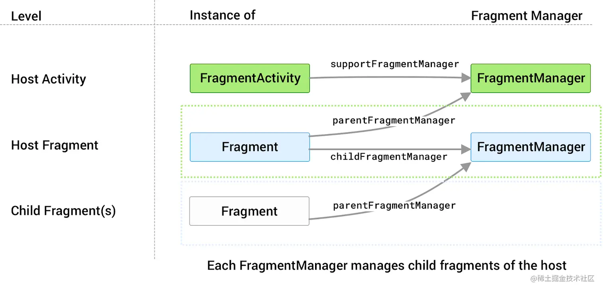
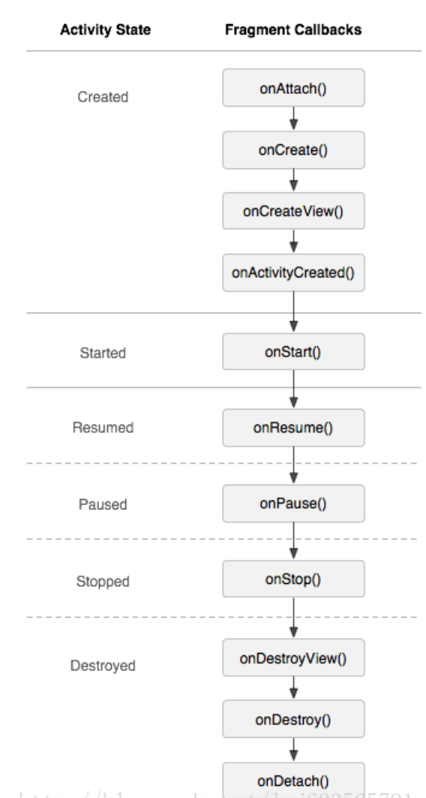

一文实践Fragemnt
https://juejin.cn/post/7006970844542926855

## 声明
目前 Fragment 已支持直接在构造函数中传入 layoutId，并在 onCreateView 方法中自动完成 View 的 inflate 操作，这样子类就无需重写 onCreateView 方法了
因此，最简单的情况下我们仅需要一行代码就可以声明一个 Fragment 子类

### 添加
#### FragmentContainerView
Fragment 一般情况下都需要和 FragmentActivity 组合使用，而我们日常使用的 AppCompatActivity 就已经直接继承于 FragmentActivity 了。此外，虽然 Fragment 可以选择任意 ViewGroup 作为其容器，但官方强烈推荐使用 FrameLayout 的子类 FragmentContainerView，因为其修复了 Fragment 在执行转场动画时的一些问题
如果想要通过代码在合适的时机再来主动注入 Fragment，那么也可以不声明 name 属性，改为通过 supportFragmentManager 来主动执行 add 操作。此外，由于当发生 Configuration Change 时，系统会自动恢复重建每个 Activity 和 Fragment，因此我们需要主动判断当前 Activity 是否属于正常启动，对应savedInstanceState == null，此时才去主动添加 Fragment，否则就会造成两个 Fragment 重叠在一起
```kotlin
class MyFragmentActivity : AppCompatActivity() {

    override fun onCreate(savedInstanceState: Bundle?) {
        super.onCreate(savedInstanceState)
        setContentView(R.layout.activity_my_fragment)
        if (savedInstanceState == null) {
            supportFragmentManager.commit {
                add(R.id.fragmentContainerView, PlaceholderFragment())
                setReorderingAllowed(true)
                addToBackStack(null)
            }
        }
    }

}

```


**SupportFragmentManager.commit方法**是fragment-ktx库中提供的扩展方法，实际上也只是对 FragmentManager 和 FragmentTransaction 做了一层封装


## **回退栈**
FragmentTransaction 的回退栈中保留的是事务而非具体的 Fragment 实例，能响应返回事件的是我们向其中提交的事务，具体的响应结果就是将该事务撤销，恢复到之前的状态

## **生命周期**

### **FragmentLifeCycle**
Activity 和 Fragment 都实现了 LifecycleOwner 接口，都包含了一个 Lifecycle 对象用于标记其生命周期状态，因此我们能够在这两者中以和生命周期绑定的方式对 LiveData 进行监听，就像以下代码一样，当中 textLiveData 关联的 this 即 LifecycleOwner 对象，从而保证了只有当 Fragment 处于前台活跃状态时才会收到数据回调
```kotlin
class PageFragment : Fragment() {

    private val pageViewModel by lazy {
        ViewModelProvider(this@PageFragment).get(PageViewModel::class.java).apply {
            textLiveData.observe(this@PageFragment, {

            })
        }
    }

}

```
Lifecycle.State 一共包含五种值，FragmentLifecycle 会在这五个值中不断流转，例如当切换为 DESTROYED 状态时，也即意味 onDestory()、onDetach() 等方法被调用了，至此 Fragment 的本次生命周期也就结束了
kotlin复制代码    public enum State {
DESTROYED,
INITIALIZED,
CREATED,
STARTED,
RESUMED;
}


### **FragmentViewLifeCycle**
Fragment 相对于 Activity 来说比较特殊，因为其关联的 View 对象可以在单次 FragmentLifecycle 过程中先后多次加载和销毁，因此实际上 FragmentView 的生命周期和 Fragment 并不同步
Fragment 内部也声明了九种状态值用于标记其自身的生命周期状态，当中就包含一个 VIEW_CREATED，即表示 FragmentView 已经被创建了，从这也可以看出 Fragment 内部维护的生命周期密度要比 FragmentLifecycle 小得多
```kotlin
static final int INITIALIZING = -1;          // Not yet attached.
static final int ATTACHED = 0;               // Attached to the host.
static final int CREATED = 1;                // Created.
static final int VIEW_CREATED = 2;           // View Created.
static final int AWAITING_EXIT_EFFECTS = 3;  // Downward state, awaiting exit effects
static final int ACTIVITY_CREATED = 4;       // Fully created, not started.
static final int STARTED = 5;                // Created and started, not resumed.
static final int AWAITING_ENTER_EFFECTS = 6; // Upward state, awaiting enter effects
static final int RESUMED = 7;                // Created started and

```
状态值切换到 DESTROYED，对于 FragmentLifecycle 来说意味着 onDestroy、onDetach 等方法被调用，对于 FragmentViewLifecycle 来说则意味着onDestroyView方法被调用，因此 FragmentViewLifecycle 的跨度范围要比 FragmentLifecycle 小一些。而且 FragmentLifecycle 切换到 DESTROYED 后状态值是不可逆的，无法再次更改，而 FragmentViewLifecycle 切换到 DESTROYED 后是有机会再次更改的，因为 View 对象可以先后多次加载和销毁，每次加载就意味着生命周期的重新开始

Fragment 提供了一个getViewLifecycleOwner()方法由于提供 FragmentViewLifecycle，从中可以看出该方法只能在 onCreateView() 到 onDestroyView() 之间被调用，即只能在 FragmentView 创建了且销毁之前使用，否则将直接抛出异常
@Nullable
FragmentViewLifecycleOwner mViewLifecycleOwner;

    @MainThread
    @NonNull
    public LifecycleOwner getViewLifecycleOwner() {
        if (mViewLifecycleOwner == null) {
            throw new IllegalStateException("Can't access the Fragment View's LifecycleOwner when "
                    + "getView() is null i.e., before onCreateView() or after onDestroyView()");
        }
        return mViewLifecycleOwner;
    }


FragmentViewLifecycle 非常有用，我们在日常开发中可以根据实际情况使用 FragmentViewLifecycle 来替代 FragmentLifecycle，因为 FragmentLifecycle 存在着一些并不明显的使用误区，很容易就造成 bug

### 问题
存在一个藏得很深的问题：假如 FragmentView 真的销毁重建了，重建后的 FragmentView 也收不到 （全局fragmentViewModel设置的）textLiveData 已有的数据！！！

会出现该问题的本质原因还是因为 FragmentView 的生命周期和 Fragment 并不同步。如果 Fragment 已经接收过 textLiveData 的回调了，那么当 FragmentView 销毁重建后，由于 textLiveData 的值没有发生变化，和 textLiveData 绑定的 LifecycleOwner 也还一直存在着，那么重建后的 FragmentView 自然就不会收到 textLiveData 的回调了，从而导致无法根据回调来重建页面

为了解决该问题，就需要使用到 FragmentViewLifecycle 了。由于 FragmentViewLifecycle 的生命周期在 onDestoryView的时候就结束了，此时也会自动移除 Observer，因此我们可以直接在 onViewCreated 方法中使用 viewLifecycleOwner 来监听 textLiveData，从而保证每次重建后的 FragmentView 都能收到回调
```kotlin
    private val pageViewModel by lazy {
        ViewModelProvider(this).get(PageViewModel::class.java)
    }
    
    override fun onViewCreated(view: View, savedInstanceState: Bundle?) {
        super.onViewCreated(view, savedInstanceState)
        pageViewModel.textLiveData.observe(viewLifecycleOwner, Observer {
            //TODO
        })
    }

```

在大部分情况下，我们在 Fragment 中执行的操作都是和 FragmentView 强关联的，属于视图操纵行为，
此时就可以使用 FragmentViewLifecycle 来替代 FragmentLifecycle，
从而保证事件一定只有**在 FragmentView 存在且活跃的情况下才会被回调**，
且保证了**每次 FragmentView 被销毁重建的时候都能够**得到最新数据。
而对于那些依赖于 Fragment 完整生命周期的事件，就还是只能继续使用 FragmentLifecycle 了

### FragmentFactory
FragmentFactory 的好处有：

将本应该直接传递给 Fragment 的构造参数转交给了 FragmentFactory，这样系统在恢复重建时就能统一通过 instantiate 方法来重新实例化 Fragment，而无需关心 Fragment 的构造函数
只要 FragmentFactory 包含了所有 Fragment 均需要的构造参数，那么同个 FragmentFactory 就可以用于实例化多种不同的 Fragment，从而解决了需要为每个 Fragment 均声明静态工厂方法的问题，Fragment 也省去了向 Bundle 赋值取值的操作，减少了开发者的工作量

FragmentFactory 也存在着局限性：

由于需要考虑 Fragment 恢复重建的场景，因此我们在 super.onCreate 之前就需要先初始化 supportFragmentManager.fragmentFactory，这样 Activity 在恢复重建的时候才能根据已有参数来重新实例化 Fragment，这就要求我们必须在一开始的时候就确定 FragmentFactory 的构造参数，也即 Fragment 的构造参数，而这在日常开发中并非总是能够做到的，因为 Fragment 的构造参数可能是需要动态生成的

### 结果回调逻辑

#### Activity Result API
* ActivityResultContract
  官方也提供了一个用于请求权限的 ActivityResultContract 实现类：RequestMultiplePermissions，通过该 Contract 我们也能以很简单的方式完成以前割裂且麻烦的申请操作

使用 Activity Result API 的好处有：

完全隔绝了请求的发起者和处理者之间的引用关系，发起者直接面向于 ActivityResultContract，无需知道请求最终是交由谁处理，这样开发者就可以随时替换 ActivityResultContract 的具体实现逻辑了，避免耦合且易于测试
请求的发起逻辑和处理逻辑都能够得到复用，减少了重复代码
统一了 startActivityForResult 和 requestPermissions的请求方式，并提供了更加简洁方便的回调方法，避免了以前申请逻辑和回调逻辑是完全割裂开的情况


#### Fragment Result API
Activity Result API 适用于 Fragment 和非载体 Activity 之间进行数据通信的场景，如果是多个 Fragment 之间或者是 Fragment 和载体 Activity 之间要进行数据通信的话，我们可以选择的实现方法有很多种：

* Fragment 通过 FragmentManager 拿到另一个 Fragment 的实例对象，通过直接调用对方的方法来实现多个 Fragment 之间的数据通信
* Fragment 和 Activity 之间相互注册回调接口，以此来实现 Fragment 和载体 Activity 之间的数据通信
* Fragment 以 Activity 作为中转站将事件转交给其它 Fragment，以此来实现多个 Fragment 之间的数据通信
* Fragment 和 Activity 同时持有相同一个 Activity 级别的 ViewModel 实例，以此来实现多个 Fragment 之间、Fragment 和载体 Activity 之间的数据通信

以上四种方法都可以实现需求，但也存在着一些问题：

前三种方法造成了 Fragment 之间、Fragment 和 Activity 之间存在强耦合，且由于并不清楚对方处于什么生命周期状态，一不小心就可能导致 NPE
最后一种方法对于生命周期安全有保障，但如果只是简单的数据通信场景的话，使用 ViewModel 就有点大材小用了，ViewModel 比较适用于数据量稍大的业务场景

##### FragmentResult
使用 FragmentResult 进行数据通信不需要持有任何 Fragment 或者 Activity 的引用，仅需要使用 FragmentManager 就可以实现
看个小例子。声明一个 Activity 和两个 Fragment，分别向对方正在监听的 requestKey 下发数据，数据通过 Bundle 来进行传递，Activity 和 Fragment 只需要面向特定的 requestKey 来发送数据或者监听数据即可，无需关心数据的来源和去向

setFragmentResult 方法表示的是向 requestKey 下发数据
setFragmentResultListener 表示的是对 requestKey 进行监听

```kotlin
const val requestKeyToActivity = "requestKeyToActivity"

private const val requestKeyFirst = "requestKeyFirst"

private const val requestKeySecond = "requestKeySecond"

class FragmentResultApiAFragment : Fragment(R.layout.fragment_fragment_result_api_a) {

    private val requestKeyFirst = "requestKeyFirst"

    private val requestKeySecond = "requestKeySecond"

    override fun onViewCreated(view: View, savedInstanceState: Bundle?) {
        super.onViewCreated(view, savedInstanceState)
        val btnSend = view.findViewById<Button>(R.id.btnSend)
        val btnSendMsgToActivity = view.findViewById<Button>(R.id.btnSendMsgToActivity)
        val tvMessage = view.findViewById<TextView>(R.id.tvMessage)
        btnSend.setOnClickListener {
            val bundle = Bundle()
            bundle.putString("fromFragmentResultApiAFragment", Random.nextInt().toString())
            //向对 requestKeyFirst 进行监听的 Fragment 传递数据
            parentFragmentManager.setFragmentResult(requestKeyFirst, bundle)
        }
        btnSendMsgToActivity.setOnClickListener {
            val bundle = Bundle()
            bundle.putString("fromFragmentResultApiAFragment", Random.nextInt().toString())
            //向对 requestKeyToActivity 进行监听的 Activity 传递数据
            parentFragmentManager.setFragmentResult(requestKeyToActivity, bundle)
        }
        //对 requestKeySecond 进行监听
        parentFragmentManager.setFragmentResultListener(
            requestKeySecond,
            this,
            { requestKey, result ->
                tvMessage.text = "requestKey: $requestKey \n result: $result"
            })
    }

}

class FragmentResultApiBFragment : Fragment(R.layout.fragment_fragment_result_api_b) {

    override fun onViewCreated(view: View, savedInstanceState: Bundle?) {
        super.onViewCreated(view, savedInstanceState)
        val btnSend = view.findViewById<Button>(R.id.btnSend)
        val tvMessage = view.findViewById<TextView>(R.id.tvMessage)
        btnSend.setOnClickListener {
            val bundle = Bundle()
            bundle.putString("fromFragmentResultApiBFragment", Random.nextInt().toString())
            //向对 requestKeySecond 进行监听的 Fragment 传递数据
            parentFragmentManager.setFragmentResult(requestKeySecond, bundle)
        }
        //对 requestKeyFirst 进行监听
        parentFragmentManager.setFragmentResultListener(
            requestKeyFirst,
            this,
            { requestKey, result ->
                tvMessage.text = "requestKey: $requestKey \n result: $result"
            })
    }

}

class FragmentResultApiActivity : BaseActivity() {

    override val bind by getBind<ActivityFragmentResultApiBinding>()

    override fun onCreate(savedInstanceState: Bundle?) {
        super.onCreate(savedInstanceState)
        supportFragmentManager.setFragmentResultListener(
            requestKeyToActivity,
            this,
            { requestKey, result ->
                bind.tvMessage.text = "requestKey: $requestKey \n result: $result"
            })
    }

}
```


使用 Fragment Result API 的好处有：

Fragment Result API 并不局限于 Fragment 之间，只要 Activity 也持有和 Fragment 相同的 FragmentManager 实例，也可以用以上方式在 Activity 和 Fragment 之间实现数据通信。但需要注意，一个 requestKey 所属的数据只能被一个消费者得到，后注册的 FragmentResultListener 会把先注册的给覆盖掉
Fragment Result API 也可以用于在父 Fragment 和子 Fragment 之间传递数据，但前提是两者持有的是相同的 FragmentManager 实例。例如，如果要将数据从子 Fragment 传递给父 Fragment，父 Fragment 应通过getChildFragmentManager() 来调用setFragmentResultListener()，而不是getParentFragmentManager()
数据的发送者只负责下发数据，不关心也不知道有多少个接收者，也不知道数据是否有被消费。数据的接收者只负责接收数据，不关心也不知道有多少个数据源。避免了 Activity 和 Fragment 之间存在引用关系，使得每个个体之间更加独立
只有当 Activity 和 Fragment 至少处于 STARTED 状态，即只有处于活跃状态时才会接收到数据回调，非活跃状态下连续传值也只会保留最新值，当切换到 DESTROYED 状态时也会自动移除监听，从而保证了生命周期的安全性

每一个载体（Activity 或者 Fragment）都包含一个和自身同等级的 FragmentManager 用于管理子 Fragment，对应 Activity 的 supportFragmentManager 和 Fragment 的 childFragmentManager；每一个 子 Fragment 也都包含一个来自于载体的 FragmentManager，对应 Fragment 的 parentFragmentManager




# Fragment妙用

## 监听生命周期

### Jetpack LifeCycle
通过 Lifecycle 来收到 Activity 生命周期状态变化的通知的，而 Lifecycle 就是通过向 Activity 注入一个无 UI 界面的 Fragment 得知 Activity 生命周期状态变化的

#### 链路

1. AppCompatActivity继承于ComponentActivity
2. ComponentActivity的onCreate中`ReportFragment.injectIfNeededIn(this);`
3. ReportFragment的inJectIfNeededIn(activity),以 android.app.Activity 对象作为入参参数，此方法内部就会向 Activity 添加一个无 UI 界面的 ReportFragment
```java
public static void injectIfNeededIn(Activity activity) {
if (Build.VERSION.SDK_INT >= 29) {
// On API 29+, we can register for the correct Lifecycle callbacks directly
activity.registerActivityLifecycleCallbacks(
new LifecycleCallbacks());
}
//向 activity 添加一个不可见的 framework 中的 fragment，以此来取得 Activity 生命周期事件的回调
android.app.FragmentManager manager = activity.getFragmentManager();
if (manager.findFragmentByTag(REPORT_FRAGMENT_TAG) == null) {
manager.beginTransaction().add(new ReportFragment(), REPORT_FRAGMENT_TAG).commit();
// Hopefully, we are the first to make a transaction.
manager.executePendingTransactions();
}
}
```

4. ReportFragment通过自身的各个回调方法来间接获得Activity生命周期时间的回调通知
```java
	@Override
    public void onActivityCreated(Bundle savedInstanceState) {
        super.onActivityCreated(savedInstanceState);
        ···
        dispatch(Lifecycle.Event.ON_CREATE);
    }

    @Override
    public void onStart() {
        super.onStart();
        ···
        dispatch(Lifecycle.Event.ON_START);
    }

    @Override
    public void onDestroy() {
        super.onDestroy();
        dispatch(Lifecycle.Event.ON_DESTROY);
        ···
    }

```

### glide监听容器是否处于活跃状态
我们加载的图片通常是要显示在 ImageView 中的，而 ImageView 是会挂载在 Activity 或者 Fragment 等容器上的，当容器处于后台或者已经被 finish 时，此时加载图片的操作就应该被取消或者停止，否则也是在浪费宝贵的系统资源和网络资源，甚至可能发生内存泄露或者 NPE。那么，显而易见的一个问题就是，Glide 是如何判断容器是否还处于活跃状态的呢？
类似于 Jetpack 组件中的 Lifecycle 的实现思路，Glide 也是通过一个无 UI 界面的 Fragment 来间接获取容器的生命周期状态的
#### 链路
首先，Glide 包含一个 LifecycleListener，定义了三种事件通知回调，用于通知容器的活跃状态：是处于前台、后台、还是已经退出了。具体的实现类是 ActivityFragmentLifecycle
```java
public interface LifecycleListener {
void onStart();
void onStop();
void onDestroy();
}
```

ActivityFragmentLifecycle 用于 SupportRequestManagerFragment 这个 Fragment 中来使用（省略了部分代码）。可以看到，在 Fragment 的三个生命周期回调事件中，都会相应通知 ActivityFragmentLifecycle。那么，不管 ImageView 的载体是 Activity 还是 Fragment，我们都可以向其注入一个无 UI 界面的 SupportRequestManagerFragment，以此来监听载体在整个生命周期内活跃状态的变化
```java
public class SupportRequestManagerFragment extends Fragment {

private static final String TAG = "SupportRMFragment";

private final ActivityFragmentLifecycle lifecycle;

public SupportRequestManagerFragment() {
this(new ActivityFragmentLifecycle());
}

@VisibleForTesting
@SuppressLint("ValidFragment")
public SupportRequestManagerFragment(@NonNull ActivityFragmentLifecycle lifecycle) {
this.lifecycle = lifecycle;
}

@NonNull
ActivityFragmentLifecycle getGlideLifecycle() {
return lifecycle;
}

@Override
public void onStart() {
super.onStart();
lifecycle.onStart();
}

@Override
public void onStop() {
super.onStop();
lifecycle.onStop();
}

@Override
public void onDestroy() {
super.onDestroy();
lifecycle.onDestroy();
unregisterFragmentWithRoot();
}

@Override
public String toString() {
return super.toString() + "{parent=" + getParentFragmentUsingHint() + "}";
}

}
```


## 方法代理
Fragment 还有一种特殊的用法。我们平时是通过 requestPermissions()、onRequestPermissionsResult() 等方法来申请权限的，在一个地方发起权限申请操作，在另一个特定方法里拿到申请结果，整个流程是异步且割裂开的。而 Fragment 包含了很多个和 Activity 完全一样的 API，其中就包括这两个权限申请方法，因此我们可以通过自动向载体挂载一个无 UI 界面的 Fragment，让 Fragment 来代理整个权限申请流程，使得载体可以用流式申请的方式来完成整个操作
一个简单的小例子:
```kotlin
  class RequestPermissionsFragment : Fragment() {

  companion object {

       private const val EXTRA_PERMISSIONS = "github.leavesC.extra.PERMISSIONS"

       private const val REQUEST_CODE = 100

       fun request(
           activity: FragmentActivity,
           permissions: Array<String>,
           onRequestResult: ((Array<String>, IntArray) -> Unit)
       ) {
           val bundle = Bundle()
           bundle.putStringArray(EXTRA_PERMISSIONS, permissions)
           val requestPermissionsFragment = RequestPermissionsFragment()
           requestPermissionsFragment.arguments = bundle
           requestPermissionsFragment.onRequestResult = onRequestResult
           activity.supportFragmentManager.commit {
               setReorderingAllowed(true)
               addToBackStack(null)
               add(requestPermissionsFragment, null)
           }
       }

  }

  private val permissions by lazy {
  requireArguments().getStringArray(EXTRA_PERMISSIONS) ?: throw IllegalArgumentException()
  }

  private var onRequestResult: ((Array<String>, IntArray) -> Unit)? =
  null

  override fun onAttach(context: Context) {
  super.onAttach(context)
  requestPermissions(permissions, REQUEST_CODE)
  }

  override fun onRequestPermissionsResult(
  requestCode: Int,
  permissions: Array<String>,
  grantResults: IntArray
  ) {
  onRequestResult?.invoke(permissions, grantResults)
  parentFragmentManager.popBackStack()
  }

  override fun onDestroyView() {
  super.onDestroyView()
  onRequestResult = null
  }

}
```


之后在 FragmentActivity 或者 Fragment 中就可以通过以下方式来完成整个权限申请操作了，直接在回调里拿到申请结果
```kotlin
RequestPermissionsFragment.request(
fragmentActivity,
arrayOf(
Manifest.permission.ACCESS_FINE_LOCATION,
Manifest.permission.CAMERA
)
) { permissions: Array<String>,
grantResults: IntArray ->
permissions.forEachIndexed { index, s ->
showToast("permission：" + s + " grantResult：" + grantResults[index])
}
}
```




fragment功能
https://blog.csdn.net/lmj623565791/article/details/37970961
https://blog.csdn.net/lmj623565791/article/details/37992017

使用
https://blog.csdn.net/lmj623565791/article/details/42628537