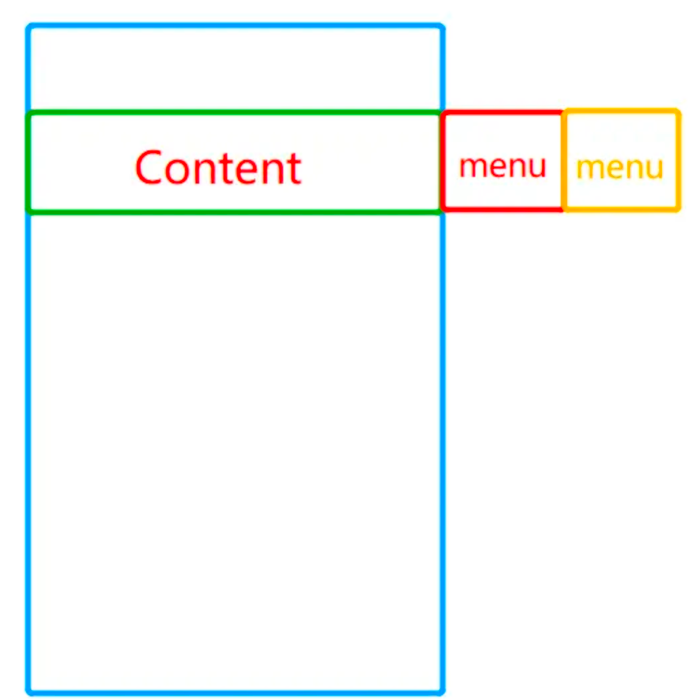

## 滑动删除
> https://mp.weixin.qq.com/s/uyyhkBoxKB4IyE3akxIRXA
> https://blog.csdn.net/dapangzao/article/details/80524774

侧滑菜单是 App 中常见的一个功能，理解了它的原理可以对自定义 ViewGroup 的测量、摆放及触摸事件的处理有更深的理解。
这个效果可以从不同的角度，内部拦截法，和外部拦截法来实现：
* 1）父布局来处理、分发事件，控制子 view 的位置，也就是通过自定义 RecyclerView 实现

* 2）通过子 ViewGroup 拦截事件，处理事件来实现，也就是自定义 ItemView 的布局

### 布局
content 占满屏幕，菜单View在屏幕之外，当滑动的时候，content 滑屏幕，menu 进入屏幕，就达到了需要的效果，布局草图如下：



## 自定义RecyclerView
自定义RecyclerView方式有三个关键点：
* 根据触摸点找到触摸的ItemView 
* 何时拦截事件 
* 如何让的Menu展开/隐藏

### 1.1 根据触摸点找到触摸的ItemView

#### 1.1.1 ListView

##### mTouchPosition
在ListView中有个pointToPosition(int x, int y)的方法，该方法其实是其父类AbsListView中实现的，作用就是定位触摸点在list中mTouchPosition。但是这个position并不是子view的下标position，我们知道ListView以及RecyclerView的实现都是采用ViewHolder模式对View进行了复用，其实界面上只有那几个View，不是随着数据项的增加而增加，因此通过getChildAt(position)的方式其实并不能获得真正被触摸到的View。

##### mFirstPosition

在ListView中还有个getFirstVisiblePosition()的方法，当然还是AbsListView中实现的，该方法用于获得屏幕上展示的第一个ItemView对应的数据集合中数据的mFirstPosition。

##### ListView触摸点子view
这样，我们有了第一个位置的mFirstPosition，又有了触摸点的mTouchPosition，两个位置相减，就得到了被触摸到的子View的下标position，这样再通过getChildAt(position)的方式即可获得触摸点的子View。

#### 1.1.2 RecyclerView
这些方式是否适用于RecyclerView?答案是不适用，因为ListView继承了AbsListView从而具有了这些便捷的方法，而RecyclerView却是继承了ViewGroup实现的，并没有上面的俩方法。

很简单，我们在使用RecyclerView实现ListView的效果时，一定要设置其LayoutManager为LinearLayoutManager，而LinearLayoutManager的类说明是：

```java
A RecyclerView.LayoutManager implementation which provides similar functionality to android.widget.ListView.
```
LayoutManager 提供了与ListView相似的功能。
findFirstVisibleItemPosition()方法，可以实现与getFirstVisiblePosition()一样的效果，而pointToPosition(int x, int y)这个则没有提供，因此我们需要自己来实现
```java
private static final int INVALID_POSITION = -1; // 触摸到的点不在子View范围内
private Rect mTouchFrame;   // 子View所在的矩形范围
public int pointToPosition(int x, int y) {
    int firstPosition = ((LinearLayoutManager) getLayoutManager()).findFirstVisibleItemPosition();
    Rect frame = mTouchFrame;
    if (frame == null) {
        mTouchFrame = new Rect();
        frame = mTouchFrame;
    }

    final int count = getChildCount();
    for (int i = count - 1; i >= 0; i--) {
        final View child = getChildAt(i);
        if (child.getVisibility() == View.VISIBLE) {
            child.getHitRect(frame);
            if (frame.contains(x, y)) {
                return firstPosition + i;
            }
        }
    }
    return INVALID_POSITION;
}
```
分析：首先获取第一个View对应的mFirstPosition，然后使用Rect.contains(x, y)通过遍历所有子View的范围来确定指定的点所在的子view。然后position + i，即可获得到触碰点的position。

#### code

RecyclerView是通过复用ItemView来避免创建大量对象，提高性能的，因此它内部的子view也就是一屏中可以看到的那些ItemView，可以通过遍历RecyclerView的所有子View，根据子View的 Bound，也就是一个 Rect，来判断触摸点是不是在这个ItemView中，也就能找到触摸点所在的ItemView。
```java
Rect frame = new Rect();

final int count = getChildCount();
for (int i = count - 1; i >= 0; i--) {
 final View child = getChildAt(i);
 if (child.getVisibility() == View.VISIBLE) {
            // 获取子view的bound
            child.getHitRect(frame);
            // 判断触摸点是否在子view中
            if (frame.contains(x, y)) {
                return i;
            }
 }
}
```

### 1.2 拦截事件
RecyclerView需要处理手势事件，内部的ItemVIew也需要处理事件，那在何时去拦截事件呢？分以下两种情况：

ACTION_DOWN 时，如果已经有ItemView处于展开状态，并且这次点击的对象不是已打开的那个ItemView，则拦截事件，并将已展开的ItemView关闭。

ACTION_MOVE 时，有俩判断，满足其一则认为是侧滑：1. x方向速度大于y方向速度，且大于最小速度限制；2. x方向的侧滑距离大于y方向滑动距离，且x方向达到最小滑动距离；
```kotlin
public class SwipeDeleteRecyclerView extends RecyclerView {
    @Override
    public boolean onInterceptTouchEvent(MotionEvent e) {
        ...
        switch (e.getAction()) {
            // 第一种情况
            case MotionEvent.ACTION_DOWN:
                ...
                // 已经有ItemView处于展开状态，并且这次点击的对象不是已打开的那个ItemView
                if (view != null && mFlingView != view && view.getScrollX() != 0) {
                    // 将已展开的ItemView关闭
                    view.scrollTo(0, 0);
                    // 则拦截事件
                    return true;
                }
              break;
             // 第二种情况
             case MotionEvent.ACTION_MOVE:
                mVelocityTracker.computeCurrentVelocity(1000);
                // 此处有俩判断，满足其一则认为是侧滑：
                // 1.如果x方向速度大于y方向速度，且大于最小速度限制；
                // 2.如果x方向的侧滑距离大于y方向滑动距离，且x方向达到最小滑动距离；
                float xVelocity = mVelocityTracker.getXVelocity();
                float yVelocity = mVelocityTracker.getYVelocity();
                if (Math.abs(xVelocity) > SNAP_VELOCITY && Math.abs(xVelocity) > Math.abs(yVelocity)
                        || Math.abs(x - mFirstX) >= mTouchSlop
                        && Math.abs(x - mFirstX) > Math.abs(y - mFirstY)) {

                    mIsSlide = true;
                    return true;
                }
                break;
                ...
        }
        ...
    }
}

```

### 1.3 处理menu展开/隐藏
在onTouchEvent中处理事件，控制menu展开与隐藏
首先是在 ACTION_MOVE 中，如果处于侧滑状态则让目标 ItemView 通过 scrollBy() 跟着手势移动，注意判断边界

在 ACTION_UP 中，此时会产生两个结果：一个是继续展开菜单，另一个是关闭菜单。这两个结果又都分了两种情况：

当松手时向左的滑动速度超过了阈值，就让目标ItemView保持松手时的速度继续展开。
当松手时向右的滑动速度超过了阈值，就让目标ItemView关闭。
当松手时移动的距离超过了隐藏的宽度的一半(也就是最大可以移动的距离的一半)，则让ItemVIew继续展开。
当松手时移动的距离小于隐藏的宽度的一半，则让ItemVIew关闭。

```kotlin
public boolean onTouchEvent(MotionEvent e) {
 obtainVelocity(e);
 switch (e.getAction()) {
  case MotionEvent.ACTION_MOVE:
   float dx = mLastX - x;
   // 判断边界
   if (mFlingView.getScrollX() + dx <= mMenuViewWidth
     && mFlingView.getScrollX() + dx > 0) {
    // 随手指滑动
    mFlingView.scrollBy((int) dx, 0);
   }
   break;
  case MotionEvent.ACTION_UP:
   int scrollX = mFlingView.getScrollX();
   mVelocityTracker.computeCurrentVelocity(1000);
   
   if (mVelocityTracker.getXVelocity() < -SNAP_VELOCITY) {    // 向左侧滑达到侧滑最低速度，则打开
    // 计算剩余要移动的距离
    int delt = Math.abs(mMenuViewWidth - scrollX);
    // 根据松手时的速度计算要移动的时间
    int t = (int) (delt / mVelocityTracker.getXVelocity() * 1000);
    // 移动
    mScroller.startScroll(scrollX, 0, mMenuViewWidth - scrollX, 0, Math.abs(t));
   } else if (mVelocityTracker.getXVelocity() >= SNAP_VELOCITY) {  // 向右侧滑达到侧滑最低速度，则关闭
    mScroller.startScroll(scrollX, 0, -scrollX, 0, Math.abs(scrollX));
   } else if (scrollX >= mMenuViewWidth / 2) { // 如果超过删除按钮一半，则打开
    mScroller.startScroll(scrollX, 0, mMenuViewWidth - scrollX, 0, Math.abs(mMenuViewWidth - scrollX));
   } else {    // 其他情况则关闭
    mScroller.startScroll(scrollX, 0, -scrollX, 0, Math.abs(scrollX));
   }
   invalidate();
   releaseVelocity();  // 释放追踪
   break;
 }
 return true;
}


```

这里通过 VelocityTracker 来获取滑动速度，通过 Scroller 来控制 ItemView 滑动。

### 1.4 缺陷？？？无
在 RecyclerView 的 Holder 的 onBindViewHolder() 中给滑出来的菜单添加点击事件即可响应删除：
```kotlin
override fun onBindViewHolder(holder: ViewHolder, position: Int) {

 holder.tvDelete.setOnClickListener {
  onDelete(holder.adapterPosition)
 }
}

```
但是由于 RecyclerView 的复用机制，需要在点了删除菜单删除 Item 后，让 Item 关闭，不然就会出现删除一个 Item 后往下滚动，会再出来一个已展开的 Item。

```kotlin
fun onDelete(it:Int){
 mData.removeAt(it)
 adapter.notifyItemRemoved(it)
        // 调用closeMenu()关闭该item
 mBinding.rvAll.closeMenu()
}

```
关闭的方法很简单，只需要让该 Item scrollTo(0, 0)即可

```kotlin
public void closeMenu() {
    if (mFlingView != null && mFlingView.getScrollX() != 0) {
        // 关闭
        mFlingView.scrollTo(0, 0);
    }
}
```

因此该方式存在的缺陷是需要手动关闭已删除的 itemView。


## 自定义ItemView控件

自定义 ItemView 方式和自定义 RecyclerView 方式总体思路是一致的，不同点有：

* 自定义 ItemView 继承自 ViewGroup
* 自定义 ItemView 需要对子 view 进行测量摆放（如果继承自 LinearLayout 可以简化这一步）
* 自定义 ItemView 不仅需要拦截向下拦截事件（拦截子 View 的事件），还需要向上拦截，也就是拦截父 View 的事件

### 2.1 测量布局
测量过程比较简单，要将 contentView 和 menuView 分开测量。contentView 直接使用 measureChildWithMargins() 测量，测量的高度作为整个 item 的高度，menuView 的高度也要跟随其高度。menuView 测量时需要构造其对应的 widthMeasureSpec 和 widthMeasureSpec 进行测量。
```kotlin
@Override
protected void onMeasure(int widthMeasureSpec, int heightMeasureSpec) {
 super.onMeasure(widthMeasureSpec, heightMeasureSpec);
 // 隐藏的菜单的宽度
 mMenuViewWidth = 0;
        // content部分的高度
 mHeight = 0;
        // content部分的高度
 int contentWidth = 0;
    
 int childCount = getChildCount();
 for (int i = 0; i < childCount; i++) {
  View childView = getChildAt(i);
  if (i == 0) {
   // 测量ContentView
   measureChildWithMargins(childView, widthMeasureSpec, 0, heightMeasureSpec, 0);
   contentWidth = childView.getMeasuredWidth();
   mHeight = Math.max(mHeight, childView.getMeasuredHeight());
  } else {
   // 测量menu
   LayoutParams layoutParams = childView.getLayoutParams();
   int widthSpec = MeasureSpec.makeMeasureSpec(layoutParams.width, MeasureSpec.EXACTLY);
                        // mHeight作为其精确高度
   int heightSpec = MeasureSpec.makeMeasureSpec(mHeight, MeasureSpec.EXACTLY);
   childView.measure(widthSpec, heightSpec);
   mMenuViewWidth += childView.getMeasuredWidth();
  }
 }
 // 宽度取第一个Item(Content)的宽度
 setMeasuredDimension(getPaddingLeft() + getPaddingRight() + contentWidth,
   mHeight + getPaddingTop() + getPaddingBottom());
}

```

### 2.2 摆放布局
由于测量过程中已经确定了所有子 view 的宽高，因此直接摆放子 view 即可。
```kotlin
@Override
protected void onLayout(boolean changed, int l, int t, int r, int b) {
    int childCount = getChildCount();
    int left = getPaddingLeft();
    for (int i = 0; i < childCount; i++) {
        View childView = getChildAt(i);
        childView.layout(left, getPaddingTop(), left + childView.getMeasuredWidth(), getPaddingTop() + childView.getMeasuredHeight());
        left = left + childView.getMeasuredWidth();
    }
}
```

### 2.3 拦截事件
自定义ItemView实现方式拦截事件有两方面：

在 onInterceptTouchEvent() 中 return true 来实现拦截
通过 getParent().requestDisallowInterceptTouchEvent(true);阻止父 view 拦截事件
那么哪些情况需要拦截呢？其实和自定义 RecyclerView 方式差不多，分两种情况：

ACTION_DOWN 时，如果已经有 ItemView 处于展开状态，并且这次点击的对象不是已打开的那个ItemView，则拦截事件，并将已展开的 ItemView 关闭。

ACTION_MOVE 时，有俩判断，满足其一则认为是侧滑：1. x方向速度大于y方向速度，且大于最小速度限制；2. x方向的侧滑距离大于y方向滑动距离，且x方向达到最小滑动距离；

和自定义 RecyclerView 方式不同的是，自定义 RecyclerView 中可以持有已打开的 ItemView 的引用。而自定义 ItemView 中需要通过经常变量来保存已打开的 ItemView。


### 2.4 消费事件
消费事件也就是在 onTouchEvent 中对事件进行处理，实现侧滑及展开隐藏效果。实现思路也和自定义 RecyclerView 方式基本一致

### 2.5 删除Item
删除也是通过给 menuView 添加点击事件实现，和自定义 RecyclerView 方式不同之处在于不需要手动调用关闭该 ItemView 的操作。只需要在自定义 ItemView 的 onDetachedFromWindow 关闭并销毁即可
```kotlin
@Override
protected void onDetachedFromWindow() {
    if (this == mViewCache) {
        mViewCache.smoothClose();
        mViewCache = null;
    }
    super.onDetachedFromWindow();
}
```

### 2.6局限
该方式存在一个局限就是通过 holder.itemView 添加的点击事件无效，需要给其中的 contentView 添加点击事件。

```kotlin

// 给itemView设置点击事件无效
holder.itemView.setOnClickListener {
    onClick(item)
}
// 给content设置点击事件
holder.itemContent.setOnClickListener {
    onClick(item)
}
```

## 小结
3.1 共同点
两种方式的总体思路都是一样的：

布局 布局中的 content 部分宽度占据整个 ItemView 的宽度，菜单部分隐藏在 content 部分的右侧。

事件拦截 发生在 onInterceptTouchEvent 中

ACTION_DOWN 时，判断是否有打开的菜单，如果有并且不是当前事件所在的 Item，则拦截事件，并关闭菜单。
ACTION_MOVE 时，如果x方向的速度大于速度阈值并且大于y方向速度则或x方向移动距离大于距离阈值并且大于y方向移动的距离则拦截事件。
事件响应
发生在 onTouchEvent 中

ACTION_MOVE 时，通过 scrollBy() 让当前 ItemView 随着手指移动，注意判断边界。
ACTION_UP 时，如果向左滑动的速度大于阈值，并菜单没有完全打开，则通过 scroller 让其打开。需要根据速度及剩余距离计算展开需要的时间。
同上当向右滑动的速度大于阈值，并菜单没有完全关闭，则通过 scroller 让其关闭。
ACTION_UP 时，如果滑动速度小于阈值，并且滑动距离超过 menu 部分宽度的一半，则通过 scroller 让其打开；如果滑动距离小于 menu 部分宽度的一半则关闭。
3.2 不同点
自定义 RecyclerView 需要根据触摸点的位置找到对应的 itemView，并将展开的 itemView 对象保存其中；
自定义 ItemView 只需通过静态变量保存当前打开的 itemView 对象即可。
自定义 RecyclerView 在触发删除时需要在业务层手动关闭当前的 itemView 菜单。自定义 ItemView 可以自动关闭。
自定义 RecyclerView 可以通过 xml 实现布局。自定义 ItemView 需要自己测量摆放子 view（当然可以直接继承 LinearLayout 简化这一步）。
3.3 缺陷
两种方式都需要在xml中引入，存在侵入性，同时也都存在一定缺陷：

自定义 RecyclerView 方式在触发删除时需要手动关闭 menu
自定义 ViewGroup 方式对 Item 的点击事件不能通过 holder.itemView 实现，需要放在内部的 content 上实现
但是自定义 RecyclerView 方式能很好地配合 ItemTouchHelper 实现长按拖拽排序效果。对这种配合 ItemTouchHelper 实现侧滑删除+长按拖拽排序。效果如下：

3.4 注意点
在手指快速滑动时需要根据手指抬起时的速度，以及剩余要滑动的距离来计算出要scroll的时间，这样就保证了自由滑动的速度和送手时的速度一致。可以避免卡顿的情况。

## 问题

### 不响应UP DOWN
https://ask.csdn.net/questions/386025
https://blog.csdn.net/u012102149/article/details/100017162
recyclerView的 item根布局中添加
```xml

android:focusableInTouchMode="true"
        android:clickable="true"
        android:focusable="true"
```


